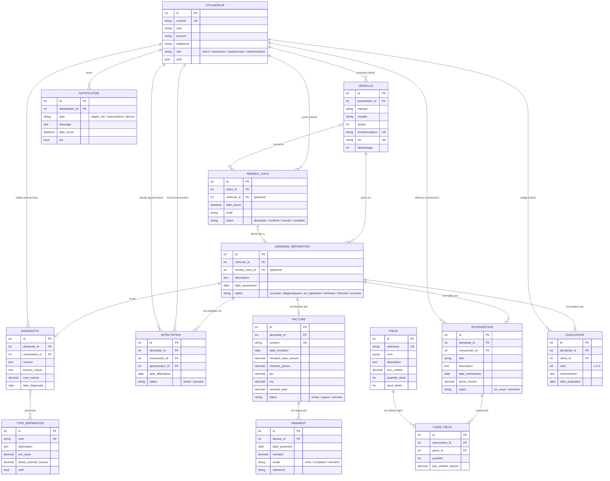

# FixMyCar — Modèle Conceptuel de Données (MCD)

**Équipe FoxTrot — INF6150 Été 2026**

Ce document est la **référence commune** pour la conception des modèles Django. Avant de créer ou modifier une table, chaque membre consulte ce MCD et la [table de correspondance](#7-correspondance-user-stories--entités) pour savoir quelles entités il crée et lesquelles il consomme. Toute divergence (nouvel attribut, nouveau statut, nouvelle relation) doit d'abord être reflétée ici, puis dans le code.

**Portée** : les 18 user stories planifiées des sprints 1 à 3 ([product backlog](product-backlog.md)). Le hors-portée (multi-garages, tableau de bord admin) n'est pas modélisé.

Le même modèle est disponible en PlantUML : [`diagrammes/mcd.puml`](../diagrammes/mcd.puml).

---

## 1. Diagramme entité-association

Notation « pattes de corbeau » (crow's foot). Seuls les attributs principaux figurent dans le diagramme; le détail complet est au [dictionnaire de données](#3-dictionnaire-de-données).

---

## 2. Règles de gestion

Cardinalités exprimées en notation Merise (min, max), lues dans les deux sens.

| # | Règle |
|---|---|
| RG1 | Un **utilisateur** a exactement un rôle : `client`, `mecanicien`, `gestionnaire` ou `administrateur`. Un compte n'est jamais supprimé physiquement s'il est référencé : il est **désactivé** (`actif = faux`), conformément au cas d'utilisation « Désactiver un compte ». |
| RG2 | Un **véhicule** appartient à un et un seul client (1,1); un client possède 0 à n véhicules (0,n). |
| RG3 | Un **rendez-vous** est pris par un et un seul client (1,1) et concerne au plus un véhicule (0,1). Un véhicule peut être visé par 0 à n rendez-vous. |
| RG4 | Une **demande de réparation** porte sur un et un seul véhicule (1,1) et peut découler d'au plus un rendez-vous (0,1). Un véhicule fait l'objet de 0 à n demandes — c'est cette relation qui fournit l'**historique des réparations** (#71). |
| RG5 | Une demande suit le cycle de vie : `soumise → diagnostiquee → en_reparation → terminee → facturee`, avec `annulee` possible avant `en_reparation`. C'est ce statut que consulte le client (#65). |
| RG6 | Un **diagnostic** est rédigé par un et un seul mécanicien (1,1) pour une et une seule demande; une demande reçoit au plus un diagnostic (0,1). Un diagnostic préconise 0 à n **types de réparation** du catalogue, et un type peut être préconisé par 0 à n diagnostics (association n,n). |
| RG7 | Une **affectation** lie une demande (1,1) à un mécanicien (1,1) et est décidée par un gestionnaire (1,1). Une demande a au plus une affectation `active` à la fois; les affectations annulées sont conservées pour la traçabilité. |
| RG8 | Une **intervention** est effectuée par un et un seul mécanicien (1,1) et se rattache à une et une seule demande (1,1); une demande peut compter 0 à n interventions. |
| RG9 | Une intervention consomme 0 à n **pièces** via des lignes de pièce; chaque ligne fige la quantité et le prix unitaire au moment de l'utilisation. La quantité en stock de la pièce est décrémentée d'autant. |
| RG10 | Une **facture** est émise pour une et une seule demande, et une demande a au plus une facture (0,1). Le total = main-d'œuvre + pièces + TPS + TVQ. |
| RG11 | Une facture est réglée par 0 à n **paiements** (paiements partiels permis); elle passe à `payee` quand la somme des paiements atteint le montant total. |
| RG12 | Une **notification** a un et un seul destinataire; un utilisateur reçoit 0 à n notifications. |
| RG13 | Une **évaluation** est rédigée par le client de la demande, au plus une par demande (0,1), et seulement lorsque la demande est `terminee` ou `facturee`. La note est un entier de 1 à 5. |
| RG14 | Seul un utilisateur de rôle `mecanicien` peut être visé par les relations « rédige un diagnostic », « effectue une intervention » et « reçoit une affectation »; seul un `gestionnaire` décide d'une affectation; seul un `client` possède des véhicules. (Contrainte applicative, validée dans les serializers.) |

---

## 3. Dictionnaire de données

Types exprimés en champs Django pour une traduction directe en modèles. Toutes les entités portent en plus les champs d'audit `date_creation` (`DateTimeField(auto_now_add=True)`) et `date_modification` (`DateTimeField(auto_now=True)`) — omis des tables ci-dessous.

### 3.1 Utilisateur (#1, #68 — AN)

Modèle utilisateur **personnalisé** (`AbstractUser`) déclaré via `AUTH_USER_MODEL`. À créer **en priorité** : changer `AUTH_USER_MODEL` après coup exige de recréer les migrations de toutes les apps (voir §6).

| Attribut | Type Django | Contraintes | Description |
|---|---|---|---|
| courriel | EmailField | unique, requis | Identifiant de connexion |
| nom | CharField(150) | requis | Nom de famille |
| prenom | CharField(150) | requis | Prénom |
| telephone | CharField(20) | optionnel | Téléphone de contact |
| role | CharField(20) | TextChoices : `client`, `mecanicien`, `gestionnaire`, `administrateur` | Rôle unique (RG1, RG14) |
| actif | BooleanField | défaut `True` | Désactivation logique (RG1) — correspond à `is_active` de Django |

### 3.2 Vehicule (#2 — GAM)

| Attribut | Type Django | Contraintes | Description |
|---|---|---|---|
| proprietaire | ForeignKey(Utilisateur) | requis, `on_delete=PROTECT`, `related_name='vehicules'` | Client propriétaire (RG2) |
| marque | CharField(100) | requis | Ex. Toyota |
| modele | CharField(100) | requis | Ex. Corolla |
| annee | PositiveIntegerField | requis | Année du modèle |
| immatriculation | CharField(20) | unique | Plaque |
| niv | CharField(17) | unique, optionnel | Numéro d'identification du véhicule (VIN) |
| kilometrage | PositiveIntegerField | optionnel | Kilométrage au dernier passage |

### 3.3 RendezVous (#63 — BI)

| Attribut | Type Django | Contraintes | Description |
|---|---|---|---|
| client | ForeignKey(Utilisateur) | requis, PROTECT, `related_name='rendez_vous'` | Client qui prend le rendez-vous (RG3) |
| vehicule | ForeignKey(Vehicule) | optionnel (null), PROTECT | Véhicule concerné (RG3) |
| date_heure | DateTimeField | requis | Date et heure convenues |
| motif | CharField(200) | requis | Raison de la visite |
| statut | CharField(20) | TextChoices : `demande`, `confirme`, `annule`, `complete`; défaut `demande` | Cycle de vie du rendez-vous |

### 3.4 DemandeReparation (#64, #65, #71 — MG / BI / SLG)

| Attribut | Type Django | Contraintes | Description |
|---|---|---|---|
| vehicule | ForeignKey(Vehicule) | requis, PROTECT, `related_name='demandes'` | Véhicule à réparer (RG4) |
| rendez_vous | OneToOneField(RendezVous) | optionnel (null), SET_NULL | Rendez-vous d'origine (RG4) |
| description | TextField | requis | Problème décrit par le client |
| date_soumission | DateField | `auto_now_add` | Date de dépôt de la demande |
| statut | CharField(20) | TextChoices : `soumise`, `diagnostiquee`, `en_reparation`, `terminee`, `facturee`, `annulee`; défaut `soumise` | Avancement consulté par le client (RG5) |

### 3.5 Diagnostic (#66 — GAM)

| Attribut | Type Django | Contraintes | Description |
|---|---|---|---|
| demande | OneToOneField(DemandeReparation) | requis, PROTECT, `related_name='diagnostic'` | Demande diagnostiquée (RG6) |
| mecanicien | ForeignKey(Utilisateur) | requis, PROTECT, `related_name='diagnostics'` | Auteur (rôle `mecanicien`, RG14) |
| resume | TextField | requis | Constat du mécanicien |
| travaux_requis | TextField | requis | Travaux recommandés |
| cout_estime | DecimalField(8,2) | optionnel | Estimation en dollars |
| date_diagnostic | DateField | requis | Date du diagnostic |
| types_reparation | ManyToManyField(TypeReparation) | `blank`, `related_name='diagnostics'` | Types préconisés (RG6) |

### 3.6 TypeReparation (#69 — MG)

Catalogue géré par le gestionnaire pour standardiser les services.

| Attribut | Type Django | Contraintes | Description |
|---|---|---|---|
| nom | CharField(100) | unique | Ex. « Changement d'huile » |
| description | TextField | optionnel (`blank`) | Détail du service |
| prix_base | DecimalField(8,2) | requis | Prix de référence |
| duree_estimee_heures | DecimalField(4,2) | requis | Durée standard |
| actif | BooleanField | défaut `True` | Retrait du catalogue sans suppression |

### 3.7 Affectation (#70 — GAM)

| Attribut | Type Django | Contraintes | Description |
|---|---|---|---|
| demande | ForeignKey(DemandeReparation) | requis, CASCADE, `related_name='affectations'` | Demande assignée (RG7) |
| mecanicien | ForeignKey(Utilisateur) | requis, PROTECT, `related_name='affectations_recues'` | Mécanicien assigné (RG14) |
| gestionnaire | ForeignKey(Utilisateur) | requis, PROTECT, `related_name='affectations_decidees'` | Décideur (RG14) |
| date_affectation | DateField | `auto_now_add` | Date de la décision |
| statut | CharField(20) | TextChoices : `active`, `annulee`; défaut `active` | Une seule `active` par demande (RG7) |

### 3.8 Intervention (#67 — SLG) — *existe déjà*

Champs actuels de `backend/interventions/models.py`, avec les évolutions prévues (voir §6).

| Attribut | Type Django | Contraintes | Description |
|---|---|---|---|
| demande | ForeignKey(DemandeReparation) | requis, PROTECT, `related_name='interventions'` | **Remplace** le champ texte `vehicule` actuel (RG8) |
| mecanicien | ForeignKey(Utilisateur) | requis, `related_name='interventions'` | Auteur de l'intervention *(existant)* |
| titre | CharField(200) | requis | Résumé court *(existant)* |
| description | TextField | requis | Travaux réalisés *(existant)* |
| date_intervention | DateField | requis | Date des travaux *(existant)* |
| duree_heures | DecimalField(4,2) | requis | Durée facturable *(existant)* |
| statut | CharField(20) | TextChoices : `en_cours`, `terminee`; défaut `en_cours` | *(existant)* |

### 3.9 Piece et LignePiece (#75 — GAM)

**Piece** — inventaire de l'atelier :

| Attribut | Type Django | Contraintes | Description |
|---|---|---|---|
| reference | CharField(50) | unique | Numéro de pièce fournisseur |
| nom | CharField(150) | requis | Désignation |
| description | TextField | optionnel (`blank`) | Détail |
| prix_unitaire | DecimalField(8,2) | requis | Prix courant |
| quantite_stock | PositiveIntegerField | défaut 0 | Stock disponible (RG9) |
| seuil_alerte | PositiveIntegerField | défaut 0 | Seuil de réapprovisionnement |

**LignePiece** — pièces consommées par une intervention (**remplace** le champ texte `pieces_utilisees`, voir §6) :

| Attribut | Type Django | Contraintes | Description |
|---|---|---|---|
| intervention | ForeignKey(Intervention) | requis, CASCADE, `related_name='lignes_pieces'` | Intervention consommatrice (RG9) |
| piece | ForeignKey(Piece) | requis, PROTECT, `related_name='lignes'` | Pièce utilisée |
| quantite | PositiveIntegerField | requis, ≥ 1 | Quantité consommée |
| prix_unitaire_facture | DecimalField(8,2) | requis | Prix figé au moment de l'utilisation (RG9) |

### 3.10 Facture (#72 — BI)

| Attribut | Type Django | Contraintes | Description |
|---|---|---|---|
| demande | OneToOneField(DemandeReparation) | requis, PROTECT, `related_name='facture'` | Demande facturée (RG10) |
| numero | CharField(20) | unique | Ex. `FAC-2026-0001` |
| date_emission | DateField | `auto_now_add` | Date d'émission |
| montant_main_oeuvre | DecimalField(8,2) | requis | Somme des heures × taux |
| montant_pieces | DecimalField(8,2) | requis | Somme des lignes de pièce |
| tps | DecimalField(8,2) | requis | Taxe fédérale (5 %) |
| tvq | DecimalField(8,2) | requis | Taxe provinciale (9,975 %) |
| montant_total | DecimalField(8,2) | requis | Total TTC (RG10) |
| statut | CharField(20) | TextChoices : `emise`, `payee`, `annulee`; défaut `emise` | Passe à `payee` selon RG11 |

### 3.11 Paiement (#73 — MG)

| Attribut | Type Django | Contraintes | Description |
|---|---|---|---|
| facture | ForeignKey(Facture) | requis, PROTECT, `related_name='paiements'` | Facture réglée (RG11) |
| date_paiement | DateField | `auto_now_add` | Date du règlement |
| montant | DecimalField(8,2) | requis, > 0 | Montant versé |
| mode | CharField(20) | TextChoices : `carte`, `comptant`, `virement` | Mode de paiement |
| reference | CharField(100) | optionnel (`blank`) | N° de transaction |

### 3.12 Notification (#76 — SLG)

| Attribut | Type Django | Contraintes | Description |
|---|---|---|---|
| destinataire | ForeignKey(Utilisateur) | requis, CASCADE, `related_name='notifications'` | Destinataire (RG12) |
| type | CharField(20) | TextChoices : `rappel_rdv`, `avancement`, `facture` | Nature de la notification |
| message | TextField | requis | Contenu affiché |
| date_envoi | DateTimeField | `auto_now_add` | Horodatage d'envoi |
| lue | BooleanField | défaut `False` | Marquage lu/non-lu |

### 3.13 Evaluation (#77 — AN)

| Attribut | Type Django | Contraintes | Description |
|---|---|---|---|
| demande | OneToOneField(DemandeReparation) | requis, PROTECT, `related_name='evaluation'` | Demande évaluée (RG13) |
| client | ForeignKey(Utilisateur) | requis, PROTECT, `related_name='evaluations'` | Auteur (client de la demande, RG13) |
| note | PositiveSmallIntegerField | requis, 1 ≤ note ≤ 5 | Note de satisfaction |
| commentaire | TextField | optionnel (`blank`) | Avis libre |
| date_evaluation | DateField | `auto_now_add` | Date de dépôt |

---

## 4. Fonctionnalités sans entité propre

Ces user stories sont des **vues/requêtes** sur les entités ci-dessus — ne pas créer de table pour elles :

- **#65 Consulter l'état des réparations** : lecture de `DemandeReparation.statut` (+ diagnostic et interventions liés).
- **#71 Historique des réparations d'un véhicule** : `Vehicule → demandes → interventions/factures`, trié par date.
- **#74 Rechercher les dossiers clients** : recherche sur `Utilisateur` + agrégation de ses véhicules, demandes et factures.
- **#78 Rapports et statistiques** : agrégations (revenus par période, charge par mécanicien, pièces les plus utilisées…).

---

## 5. Conventions communes (à respecter par tous)

1. **Nommage** : français, `snake_case`, **sans accents** dans les identifiants (`duree_heures`, `date_soumission`) — comme le code existant. Classes de modèles en `PascalCase` sans accents (`DemandeReparation`).
2. **Statuts** : toujours un `CharField` + `models.TextChoices` interne (voir `Intervention.Statut`), valeurs en `snake_case`, avec un `default`. Pas d'entiers magiques ni de booléens multiples.
3. **Audit** : chaque modèle porte `date_creation = DateTimeField(auto_now_add=True)` et `date_modification = DateTimeField(auto_now=True)`.
4. **Suppressions** : `on_delete=PROTECT` par défaut vers les entités de traçabilité (utilisateurs, véhicules, demandes, factures, pièces); `CASCADE` uniquement pour les compositions (lignes de pièce, notifications, affectations d'une demande). Les comptes utilisateurs se **désactivent**, ne se suppriment pas (RG1).
5. **`related_name`** : toujours défini, en français au pluriel (`vehicules`, `demandes`, `paiements`).
6. **Montants** : `DecimalField(max_digits=8, decimal_places=2)` — jamais de `FloatField` pour l'argent. Durées en heures : `DecimalField(max_digits=4, decimal_places=2)`.
7. **Organisation des apps Django** (une app par domaine, pour limiter les conflits de merge) : `comptes` (Utilisateur), `vehicules`, `reparations` (RendezVous, DemandeReparation, Diagnostic, TypeReparation, Affectation), `interventions` (existante : Intervention, LignePiece), `facturation` (Facture, Paiement), `inventaire` (Piece), `notifications`, `evaluations`. Ajustable en équipe, mais à décider **avant** de créer les modèles.
8. **Migrations** : une seule personne crée les migrations d'une app donnée par sprint (le responsable de la story), pour éviter les conflits de numérotation.

---

## 6. Alignement avec le code existant

Le modèle `Intervention` (`backend/interventions/models.py`) contient deux champs provisoires, documentés comme tels dans son docstring :

| Champ actuel | Provisoire parce que | Cible MCD | Quand |
|---|---|---|---|
| `vehicule = CharField(200)` | #64 (demandes) n'existait pas encore | `demande = ForeignKey(DemandeReparation)` — le véhicule se déduit de `demande.vehicule` | Dès que #64 est fusionnée (migration de données : créer les demandes correspondantes ou vider la table de dev) |
| `pieces_utilisees = TextField` | #75 (inventaire) n'existait pas encore | Lignes `LignePiece` liées à l'intervention | Sprint 3, avec #75 |
| `mecanicien` avec `on_delete=CASCADE` | — | Passer à `PROTECT` (convention §5.4) : supprimer un mécanicien ne doit pas effacer l'historique des travaux | Prochaine migration de l'app |

Par ailleurs, le projet utilise actuellement le `User` de `django.contrib.auth` sans modèle personnalisé. La story **#1/#68 (AN)** doit introduire `comptes.Utilisateur` (`AbstractUser` + champ `role`) et pointer `AUTH_USER_MODEL` dessus **avant** que d'autres apps ne créent leurs FK utilisateur : Django ne permet pas de changer `AUTH_USER_MODEL` proprement une fois les migrations de production appliquées. La FK existante `Intervention.mecanicien` utilise déjà `settings.AUTH_USER_MODEL`, elle suivra automatiquement (les migrations de dev devront être régénérées).

---

## 7. Correspondance user stories ↔ entités

| Issue | Story | Responsable | Entités **créées** | Entités consommées |
|---|---|---|---|---|
| #1 | Comptes utilisateurs | AN | Utilisateur | — |
| #2 | Véhicules | GAM | Vehicule | Utilisateur |
| #63 | Rendez-vous | BI | RendezVous | Utilisateur, Vehicule |
| #64 | Demandes de réparation | MG | DemandeReparation | Vehicule, RendezVous |
| #65 | État des réparations | BI | — (vue, §4) | DemandeReparation, Diagnostic, Intervention |
| #66 | Diagnostics | GAM | Diagnostic | DemandeReparation, TypeReparation, Utilisateur |
| #67 | Interventions mécaniques | SLG | Intervention *(existante)* | DemandeReparation, Utilisateur |
| #68 | Utilisateurs et rôles | AN | — (champ `role` de Utilisateur) | Utilisateur |
| #69 | Types de réparations | MG | TypeReparation | — |
| #70 | Affectation aux mécaniciens | GAM | Affectation | DemandeReparation, Utilisateur |
| #71 | Historique des réparations | SLG | — (vue, §4) | Vehicule, DemandeReparation, Intervention, Facture |
| #72 | Factures | BI | Facture | DemandeReparation, Intervention, LignePiece |
| #73 | Paiements | MG | Paiement | Facture |
| #74 | Dossiers clients | AN | — (vue, §4) | Utilisateur, Vehicule, DemandeReparation, Facture |
| #75 | Pièces et inventaire | GAM | Piece, LignePiece | Intervention |
| #76 | Notifications et rappels | SLG | Notification | Utilisateur, RendezVous, DemandeReparation, Facture |
| #77 | Évaluations clients | AN | Evaluation | DemandeReparation, Utilisateur |
| #78 | Rapports et statistiques | MG | — (vue, §4) | toutes |
